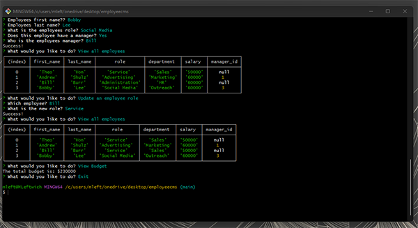

  
  # Employee CMS
  
  ## Table of Contents
  * [Description](#description)
  * [Installation](#installation)
  * [Usage](#usage)
  * [Contributing](#contributing)
  * [Guidelines](#guidelines)
  * [Tests](#tests)
  * [License](#license)
  * [Questions](#questions)
---

  ## Description
  This app is a content management system designed to interface with an employee database from the command line. The user can view department, role, and employee records and edit them accordingly, with the ability to add entries, update roles and view the overall budget of the database. It was built using node.js utilizing the inquirer and mysql2 node packages and can be used entirely from any CLI like gitbash or powershell.
  You can view a video demonstration of the app in use [here](https://drive.google.com/file/d/1RPCd4coSRzBDYQkhY5-suuFZGRCekF9r/view).

  

  ## Installation
   Clone the repository, install node and npm run start

  ## Usage
   npm run start / node app.js from the command line

  ## Contributing
   If you'd like to contribute, reach out through the email below

  ## Guidelines
   Must have an existing database named employees_db, schema is included

  ## Tests
   

  ## License
   Licensed under [MIT](https://opensource.org/licenses/MIT) 

   ---

  ## Questions
   For any questions you can find me at [GitHub](https://github.com/mleftwich) or email me at [mleftwich@live.com](mailto:mleftwich@live.com) 
